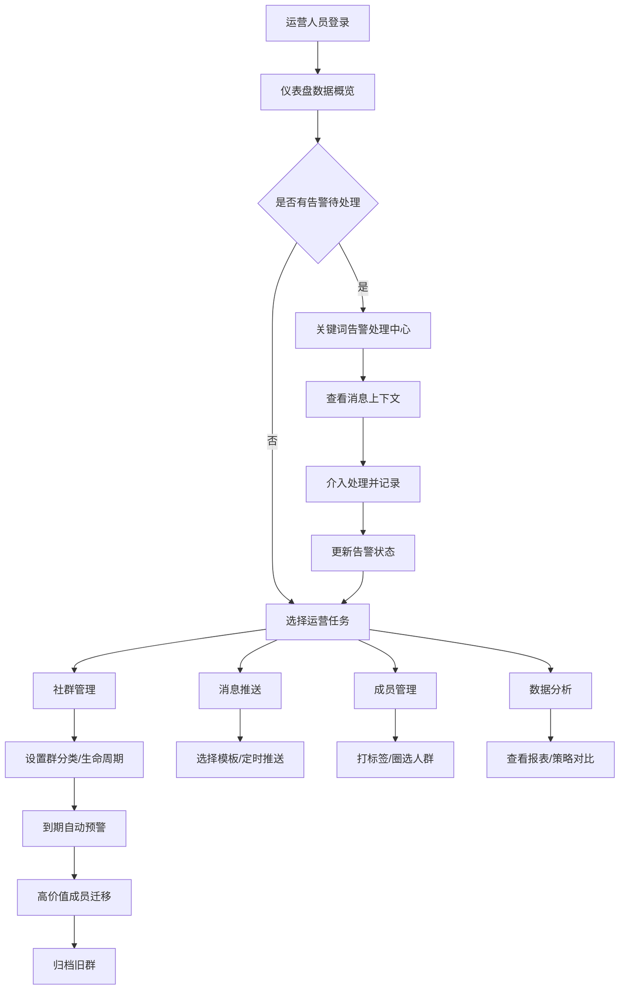

# 私域社群运营管理工具 - 产品需求文档 (PRD)

## 1. 产品概述
私域社群运营管理工具是一款面向拥有微信群/社群的品牌运营人员的一站式管理平台。通过社群分类管理、消息自动化推送、成员标签画像、关键词风控预警和数据驱动分析，帮助品牌提升私域运营效率，降低用户流失，实现精准触达和用户价值最大化。

**目标用户：** 品牌运营专员、社群运营经理、私域增长负责人  
**核心价值：** 降本增效、精准运营、风险可控、数据决策

---

## 2. 核心功能

### 2.1 用户角色

| 角色 | 登录方式 | 核心权限 |
|------|----------|----------|
| 超级管理员 | 账号密码 | 全部功能，系统配置，成员权限管理 |
| 运营管理员 | 账号密码 | 社群管理、消息推送、数据查看、成员管理 |
| 运营专员 | 账号密码 | 消息发送、关键词处理、基础数据查看 |

### 2.2 功能模块列表

1. **运营仪表盘**：关键数据概览、趋势图表、告警提醒、快捷操作入口
2. **社群管理中心**：社群列表、群分类（新客群/付费会员群/体验群）、生命周期阶段管理、群详情页
3. **消息模板库**：话术模板CRUD、模板分类、变量插入、定时推送任务调度
4. **成员标签系统**：标签库管理、自动标签规则、手动打标、标签圈群、精准触达
5. **关键词监控**：关键词词库配置、实时告警、消息溯源、处理流程记录
6. **数据分析中心**：活跃率趋势、消息量统计、成员流失率、运营策略效果对比
7. **群生命周期管理**：到期预警、群归档、高价值成员识别、一键迁移提示

### 2.3 页面详情

| 页面名称 | 模块名称 | 功能描述 |
|----------|----------|----------|
| 运营仪表盘 | 数据概览卡片 | 展示总群数、总成员数、今日消息量、活跃率、流失率、待处理告警数等核心KPI |
| 运营仪表盘 | 趋势图表 | 近7天/30天消息量趋势、活跃率走势、成员增长曲线 |
| 运营仪表盘 | 告警面板 | 待处理关键词告警列表，点击跳转处理页面 |
| 运营仪表盘 | 快捷入口 | 快速发起群发、新建模板、创建群等常用操作 |
| 社群管理中心 | 社群列表 | 卡片/列表视图切换，按类型/状态/阶段筛选，搜索群名 |
| 社群管理中心 | 群分类管理 | 标记新客群/付费会员群/体验群，支持自定义分类颜色图标 |
| 社群管理中心 | 生命周期管理 | 标记阶段：筹备期→活跃期→衰退期→归档期，设置到期时间 |
| 社群管理中心 | 群详情页 | 成员列表、消息记录、数据统计、群设置、成员迁移操作 |
| 消息模板库 | 模板列表 | 按分类（欢迎语/周报告/促销活动/售后）筛选，预览和编辑 |
| 消息模板库 | 模板编辑器 | 富文本编辑，变量占位符插入（{{昵称}}/{{会员等级}}），表情支持 |
| 消息模板库 | 定时任务 | Cron表达式设置推送时间，选择目标群组，任务日志查看 |
| 成员标签系统 | 标签库 | 标签分组（属性标签/行为标签/消费标签），创建编辑标签 |
| 成员标签系统 | 自动规则 | 按入群时间/消费金额/互动次数自动打标规则配置 |
| 成员标签系统 | 标签圈选 | 多标签组合筛选，保存人群包，一键群发或导出 |
| 关键词监控 | 词库配置 | 分组（投诉/退款/购买咨询/竞品词/敏感词），关键词正则匹配 |
| 关键词监控 | 实时告警 | 新消息实时扫描，匹配关键词即时桌面+声音提醒，告警列表 |
| 关键词监控 | 处理中心 | 标记已处理/跟进中，记录处理备注，消息跳转溯源 |
| 数据分析中心 | 活跃率分析 | 各群DAU/MAU，7日/30日活跃率排名，热力图 |
| 数据分析中心 | 消息量统计 | 分时段消息量、群消息排名、运营人员发送量统计 |
| 数据分析中心 | 流失率分析 | 退群趋势、退群成员标签画像、流失原因标记 |
| 数据分析中心 | 策略对比 | 选择多个群/时间段对比运营指标，导出分析报告 |
| 群生命周期管理 | 到期预警 | 列表展示即将到期社群，提前7/3/1天提醒 |
| 群生命周期管理 | 群归档 | 一键归档群，历史数据保留只读，成员迁移向导 |
| 群生命周期管理 | 高价值成员识别 | 按消费+活跃+互动综合评分，Top成员列表 |
| 群生命周期管理 | 成员迁移 | 批量选择成员，选择目标新群，自动发送邀请通知 |

---

## 3. 核心流程

### 3.1 日常运营流程
运营人员登录→仪表盘查看今日数据→处理关键词告警→查看到期社群提醒→根据标签圈选人群→从模板库选择话术→定时或立即推送→通过数据分析验证效果

### 3.2 关键词应急处理流程
系统实时扫描消息→匹配预设关键词→触发告警推送→运营人员收到提醒→查看消息上下文→介入处理（私聊/群内回复）→记录处理结果→更新告警状态

### 3.3 群生命周期流转流程
新建社群→设置分类和生命周期阶段→日常运营积累数据→系统监测活跃度/到期时间→触发衰退预警→识别高价值成员→创建/选择目标群→一键迁移成员→归档旧群→数据分析复盘

### 3.4 流程图

---

## 4. 用户界面设计

### 4.1 设计风格
**视觉定位：专业、高效、可信赖的企业级SaaS管理后台**

- **主色调**：深海蓝 `#1E3A5F`（专业稳重）→ 搭配商务青 `#0D9488`（数据增长）
- **辅助色**：警示橙 `#F59E0B`（提醒告警）、风险红 `#EF4444`（紧急处理）、成功绿 `#10B981`（达标状态）
- **中性色**：石墨灰系 `#111827 / #374151 / #6B7280 / #E5E7EB / #F9FAFB`
- **按钮风格**：圆角8px，主色实心按钮带微悬浮上浮效果，次选幽灵按钮配细边框
- **字体方案**：标题使用「思源黑体 Bold」(CN) + "Space Grotesk" 半粗体；正文使用「Inter Regular」+ 「思源黑体 Regular」；数据数字使用 "JetBrains Mono" 等宽字体
- **布局风格**：左侧导航栏（240px固定宽度，深色）+ 顶部面包屑（带快速搜索框）+ 主体内容卡片式栅格布局
- **图标风格**：使用Lucide图标库，统一线性风格，16px/18px尺寸，与文字保持4px间距
- **数据可视化**：深色背景配荧光色折线/柱状图，卡片顶部带细彩色指示条区分模块类型

### 4.2 页面设计概览

| 页面名称 | 模块名称 | UI元素与风格 |
|----------|----------|--------------|
| 运营仪表盘 | 数据概览卡片 | 6张卡片2×3栅格，卡片顶部2px彩色条（活跃率=青/消息量=蓝/流失率=橙），数据大号加粗数字+趋势小箭头+同比小字 |
| 运营仪表盘 | 趋势图表区 | 左右两列布局，左列消息量趋势（堆叠柱状图），右列活跃率曲线（面积图），图表悬停高亮tooltip |
| 社群管理中心 | 社群列表 | 表格视图为主，状态标签圆角胶囊，操作列悬停出现编辑/迁移按钮，行hover浅蓝高亮 |
| 消息模板库 | 模板编辑器 | 左侧分类树（可折叠），中间编辑区（富文本+变量插入面板），右侧实时预览（模拟群聊气泡） |
| 关键词监控 | 告警列表 | 带优先级颜色标识的卡片列表，紧急=红色边框+闪烁红点，点击展开消息上下文对话流 |
| 数据分析中心 | 策略对比 | 顶部维度选择器（群/时间/指标），下方多折线同图对比，底部自动生成洞察结论文字块 |

### 4.3 响应式设计
- **桌面端优先（1440px+）**：完整展示所有模块和数据
- **笔记本（1280px-1439px）**：导航栏可折叠为80px图标模式，卡片间距收紧
- **平板（768px-1279px）**：双列改为单列堆叠，图表自适应高度
- **移动端（<768px）**：底部Tab导航，表格转卡片视图，关键词告警推送通知

---

