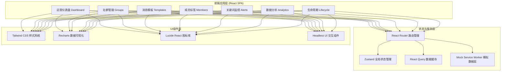
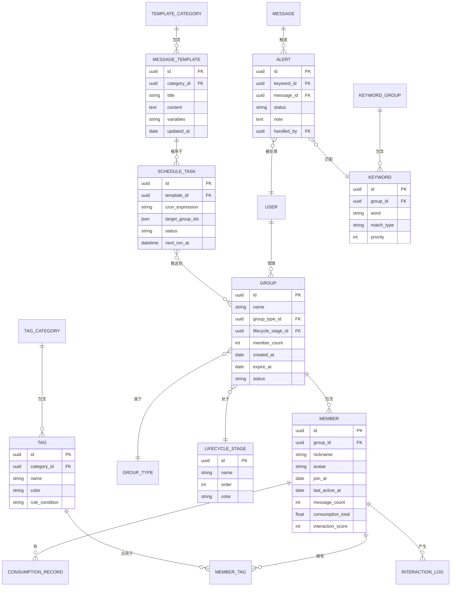

# 私域社群运营管理工具 - 技术架构文档

## 1. 架构设计



---

## 2. 技术选型说明

| 类别 | 技术 | 版本 | 用途 |
|------|------|------|------|
| 构建工具 | Vite | ^5.0.0 | 极速开发构建，HMR支持 |
| 前端框架 | React | ^18.3.0 | 组件化开发，Hooks生态 |
| 语言 | TypeScript | ^5.4.0 | 类型安全，IDE智能提示 |
| 样式 | Tailwind CSS | ^3.4.0 | 原子化CSS，主题定制 |
| 路由 | React Router DOM | ^6.22.0 | 声明式路由，嵌套布局 |
| 状态管理 | Zustand | ^4.5.0 | 轻量状态，无Boilerplate |
| 数据请求 | TanStack Query | ^5.24.0 | 服务端状态缓存，自动重取 |
| 图表库 | Recharts | ^2.12.0 | React原生图表，丰富类型 |
| 图标 | Lucide React | ^0.358.0 | 线性图标，一致性好 |
| UI组件 | Headless UI | ^1.7.19 | 无样式交互组件（模态/下拉等） |
| 工具函数 | date-fns | ^3.3.0 | 日期处理，体积小巧 |
| 工具函数 | clsx + tailwind-merge | 最新 | 条件类名合并 |
| 模拟数据 | Mock Service Worker | ^2.2.0 | 拦截请求，本地Mock接口 |

**无外部后端依赖：** 采用 MSW 本地模拟全部API接口，生成高质量Mock数据，确保功能完整可演示。

---

## 3. 路由定义

| 路由路径 | 页面组件 | 页面功能 |
|----------|----------|----------|
| `/` | Redirect → `/dashboard` | 根路径重定向 |
| `/dashboard` | DashboardPage | 运营仪表盘：KPI卡片+趋势图+告警+快捷入口 |
| `/groups` | GroupsListPage | 社群列表：筛选、搜索、分类/生命周期管理 |
| `/groups/:id` | GroupDetailPage | 群详情：成员、消息、数据、迁移操作 |
| `/templates` | TemplatesListPage | 消息模板库：分类筛选、模板列表 |
| `/templates/:id/edit` | TemplateEditorPage | 模板编辑器：富文本+变量+预览 |
| `/templates/schedule` | ScheduleTasksPage | 定时推送任务：Cron配置、目标群、日志 |
| `/members` | MembersListPage | 成员列表：标签筛选、圈选、导出 |
| `/members/tags` | TagsManagePage | 标签库管理+自动打标规则配置 |
| `/members/segments` | SegmentsPage | 人群包管理：标签组合条件、保存、触达 |
| `/alerts` | AlertsCenterPage | 关键词告警中心：列表、处理、上下文 |
| `/alerts/settings` | KeywordsConfigPage | 关键词词库配置：分组、正则匹配规则 |
| `/analytics` | AnalyticsOverviewPage | 数据分析概览：活跃率、消息量、流失率 |
| `/analytics/compare` | StrategyComparePage | 策略对比：多选维度、图表对比、洞察结论 |
| `/lifecycle` | LifecycleManagePage | 生命周期管理：到期预警、归档、迁移 |

---

## 4. 数据模型定义

### 4.1 ER图



### 4.2 核心TypeScript类型定义

```typescript
// ============ 社群相关 ============
type GroupType = 'new_customer' | 'paid_member' | 'trial' | 'custom';
type LifecyclePhase = 'preparation' | 'active' | 'declining' | 'archived';
type GroupStatus = 'normal' | 'warning' | 'expiring' | 'archived';

interface Group {
  id: string;
  name: string;
  avatar: string;
  type: GroupType;
  typeLabel: string;
  lifecycle: LifecyclePhase;
  lifecycleLabel: string;
  memberCount: number;
  activeMembers7d: number;
  messageCountToday: number;
  createdAt: string;
  expireAt: string;
  status: GroupStatus;
  owner: string;
  description: string;
  tags: string[];
}

// ============ 成员相关 ============
type TagCategory = 'attribute' | 'behavior' | 'consumption';

interface MemberTag {
  id: string;
  name: string;
  color: string;
  category: TagCategory;
  categoryLabel: string;
  memberCount: number;
  autoRule?: AutoTagRule;
}

interface AutoTagRule {
  field: 'join_days' | 'consumption_total' | 'message_count' | 'last_active_days';
  operator: '>' | '<' | '>=' | '<=' | '==' | 'between';
  value: number | [number, number];
}

interface Member {
  id: string;
  groupId: string;
  groupName: string;
  nickname: string;
  avatar: string;
  joinAt: string;
  lastActiveAt: string;
  messageCount: number;
  consumptionTotal: number;
  interactionScore: number;
  valueScore: number;
  tags: string[];
  status: 'active' | 'inactive' | 'left';
}

// ============ 消息模板相关 ============
type TemplateCategory = 'welcome' | 'weekly_report' | 'promotion' | 'after_sale' | 'custom';
type TaskStatus = 'pending' | 'running' | 'paused' | 'completed' | 'failed';

interface MessageTemplate {
  id: string;
  title: string;
  category: TemplateCategory;
  categoryLabel: string;
  content: string;
  variables: string[];
  usageCount: number;
  lastUsedAt: string;
  createdAt: string;
  createdBy: string;
}

interface ScheduleTask {
  id: string;
  name: string;
  templateId: string;
  templateTitle: string;
  cronExpression: string;
  cronDescription: string;
  targetGroupIds: string[];
  targetGroupNames: string[];
  status: TaskStatus;
  nextRunAt: string;
  lastRunAt?: string;
  lastRunResult?: 'success' | 'failed';
  totalSent: number;
  createdAt: string;
}

// ============ 关键词监控 ============
type KeywordGroupType = 'complaint' | 'refund' | 'purchase' | 'competitor' | 'sensitive' | 'custom';
type AlertPriority = 'critical' | 'high' | 'medium' | 'low';
type AlertStatus = 'pending' | 'processing' | 'resolved' | 'ignored';

interface Keyword {
  id: string;
  word: string;
  groupType: KeywordGroupType;
  groupLabel: string;
  matchType: 'exact' | 'contains' | 'regex';
  priority: AlertPriority;
  enabled: boolean;
  triggerCount: number;
}

interface Alert {
  id: string;
  keywordId: string;
  keyword: string;
  priority: AlertPriority;
  memberId: string;
  memberName: string;
  groupId: string;
  groupName: string;
  messageId: string;
  messageContent: string;
  messageTime: string;
  contextMessages: {
    id: string;
    sender: string;
    isSelf: boolean;
    content: string;
    time: string;
  }[];
  status: AlertStatus;
  note?: string;
  handledBy?: string;
  handledAt?: string;
  createdAt: string;
}

// ============ 数据统计 ============
interface DailyMetric {
  date: string;
  groupCount: number;
  memberCount: number;
  messageCount: number;
  activeMembers: number;
  newMembers: number;
  leftMembers: number;
}

interface GroupAnalytics {
  groupId: string;
  groupName: string;
  period: '7d' | '30d' | '90d';
  activeRate: number;
  avgActiveRate: number;
  activeRateTrend: DailyPoint[];
  messageTrend: DailyPoint[];
  churnRate: number;
  avgChurnRate: number;
  memberValueDistribution: { range: string; count: number }[];
}

interface DailyPoint {
  date: string;
  value: number;
}

interface StrategyCompareResult {
  groups: { id: string; name: string; color: string }[];
  metrics: { key: string; label: string; values: number[] }[];
  trends: { date: string; values: Record<string, number> }[];
  insights: string[];
}

// ============ 生命周期 ============
interface ExpiringGroup {
  id: string;
  name: string;
  type: GroupType;
  lifecycle: LifecyclePhase;
  expireAt: string;
  daysLeft: number;
  memberCount: number;
  highValueCount: number;
  suggestedAction: 'archive' | 'migrate' | 'extend';
}

interface HighValueMember {
  id: string;
  nickname: string;
  groupId: string;
  groupName: string;
  valueScore: number;
  consumptionTotal: number;
  interactionScore: number;
  lastActiveAt: string;
  tags: string[];
}
```

---

## 5. 目录结构设计

```
src/
├── assets/                 # 静态资源（字体、图片等）
├── components/             # 通用组件
│   ├── layout/            # 布局组件：Sidebar、Topbar、PageContainer
│   ├── ui/                # 基础UI：Button、Card、Modal、Table、Badge等
│   ├── charts/            # 图表组件封装
│   └── forms/             # 表单相关组件
├── pages/                 # 页面组件
│   ├── dashboard/
│   ├── groups/
│   ├── templates/
│   ├── members/
│   ├── alerts/
│   ├── analytics/
│   └── lifecycle/
├── mocks/                 # MSW Mock 接口
│   ├── handlers/          # 各模块接口处理器
│   └── data/              # Mock 数据生成器
├── store/                 # Zustand 状态
│   ├── useAuthStore.ts
│   └── useUIModeStore.ts
├── hooks/                 # 自定义 Hooks
│   ├── useAnalytics.ts
│   └── useRealtime.ts
├── types/                 # 全局 TS 类型定义
│   └── index.ts
├── utils/                 # 工具函数
│   ├── date.ts
│   ├── format.ts
│   ├── charts.ts
│   └── constants.ts
├── config/                # 配置文件
│   ├── routes.tsx
│   └── theme.ts
├── App.tsx
├── main.tsx
└── index.css
```

---

